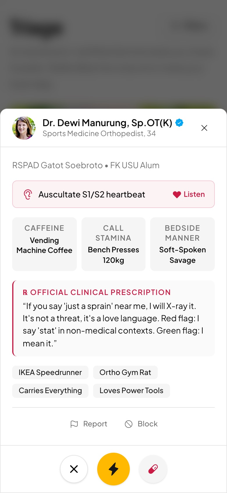
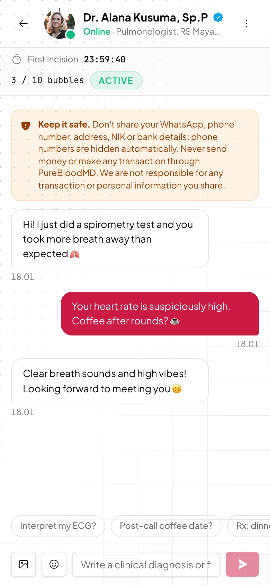
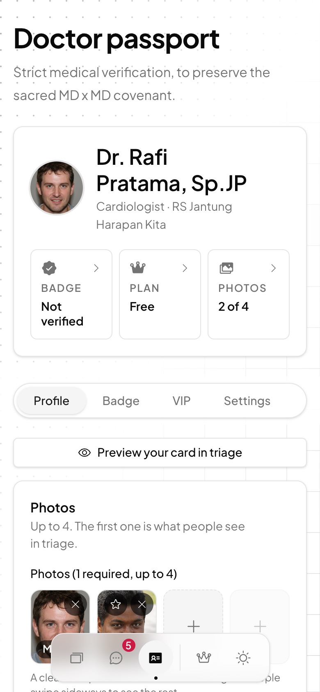
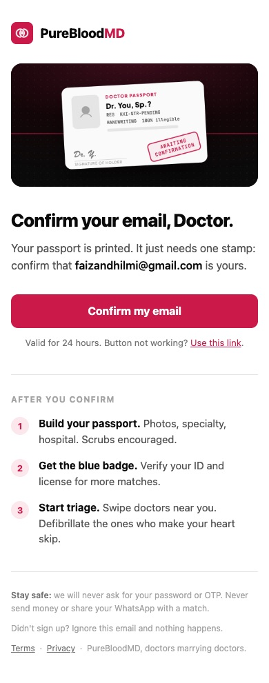

<div align="center">

<picture>
  <source media="(prefers-color-scheme: dark)" srcset="docs/assets/logo-dark.png">
  
</picture>

### Doctors marrying doctors. Est. post-call.

A parody dating app where doctors only match with doctors.<br>
Swipe in **Triage**, defibrillate the ones who make your heart skip, then flirt in **Consults**.


</div>

<p align="center">
  
  
  
  
</p>

---

## About

Every doctor knows the problem: your dates don't understand why your pager goes off during dessert, and your in-laws ask why you're "still at the hospital" at 2 AM. **PureBloodMD** fixes that with a strict MD x MD covenant. Only doctors, residents, GPs and medical students get a Doctor Passport.

Under the jokes it is a complete, working dating app:

- Real accounts, email confirmation and CAPTCHA
- Realtime chat with photos and stickers
- Verified badges and subscriptions
- Safety tools that protect members, and the people who run the app

The comedy is part of the product. Every specialty has its own one-liners, bot doctors reply in character, and the UI speaks fluent hospital.

> **Parody, not a medical service.** Nothing in the app is medical advice. VIP payments are a demo: no real money is charged.

## Founders

<table>
  <tr>
    <td align="center" width="50%">
      <h3>Faiz Hazim Hawari</h3>
      Co-founder
    </td>
    <td align="center" width="50%">
      <h3>Sonya Maysalva</h3>
      Co-founder
    </td>
  </tr>
</table>

## Features

### 🩺 Triage (swipe)
- **Drag to swipe** with prescription stamps:
  - right: **PRESCRIBED** (like)
  - left: **DISCHARGED** (pass)
  - up: **DEFIBRILLATED ⚡** (Super Like)
- **Super Like:** one per profile. Free members get 1 a day, VIP gets 5. The other doctor sees a **"Superliked you"** ribbon, and those doctors appear first in their deck.
- **Rewind:** undo your last pass or like. Free members get 1 a day, VIP is unlimited. Super Likes and matches can't be rewound.
- **Compact cards:** the photo and actions always fit on one screen. Tap ⓘ (or press ↓) for the **full chart**: vitals, bio, tags, and a heartbeat you can auscultate.
- **Photos:** up to 4 per doctor. Tap the left or right side of the photo to browse, Stories style.
- **Filters:**
  - looking for
  - verified doctors only
  - country (34 countries)
  - **radar** radius 5 to 100 km
  - specialty
  - must-have MD traits
- **Keyboard:** `←` pass, `↑` Super Like, `→` like, `↓` full chart.

### 💬 Consults (chat)
- Realtime messages, **photos** (private bucket, signed URLs), an **emoji picker** and **medical stickers**.
- **Bumble rule:** in a female x male match, she makes the first incision. This is enforced in the database.
- **10 free bubbles** per consult, then the VIP paywall.
- **Personal info guard:**
  - phone numbers and chat-app links are masked with `****` automatically
  - a warning appears before you send anything that looks like an NIK, a bank account or an OTP
- **Unmatch** and **delete chat** for both sides. Consults with no messages for 30 days are deleted automatically.
- **Online dot** through Realtime Presence.

### 🪪 Doctor Passport (profile)
- Status at a glance (badge, plan, photos), then tabs: **Profile · Badge · VIP · Settings**.
- **Live preview** of your own triage card while you edit.
- A sticky save bar that tells you when you have unsaved changes.
- Private credentials (STR, alma mater, class year), never shown to other doctors.

<p align="center">
  
  
</p>

### ✅ Verified badge
The blue badge means a human reviewed **both** the doctor's ID (KTP or passport) and their medical license (STR/SIP, or a student card for medical students). Documents go to a private bucket that members can never read.

### 👑 VIP (demo)
| Plan | Indonesia | Other countries |
|---|---|---|
| Monthly | Rp 50.000 | US$ 20 |
| 3 months | Rp 130.000 | US$ 50 |
| Annual | Rp 550.000 | US$ 230 |

VIP includes unlimited bubbles, 5 Super Likes a day and unlimited rewinds. If you cancel, VIP stays active until the end of the period you paid for.

### 🛡️ Safety
- **Report:** sexual harassment, unsolicited explicit photos, verbal abuse, threats, hate speech, fake profiles, scams, underage users, self-harm concerns, and other.
- **Block:** works from both Triage and chat.
- **Signup protection:** sign up requires a Cloudflare Turnstile **CAPTCHA**, accepting the **Terms & Privacy Policy**, and confirming you are **21+**. The accepted terms version is stored on the account.
- **Terms:** clear rules about no financial transactions and no sharing of personal information. The terms also limit the founders' liability for transactions or information exchanged between members.
- **Location privacy:** radar locations are rounded to about 1 km, and other members only ever see a distance.

### 📱 Installable app (PWA)
- Manifest, app icons and an offline page.
- A service worker in production that never caches personal data.
- Mobile-first layout with a MagicUI dock for navigation.

## Tech stack

| Layer | Tools |
|---|---|
| Framework | Next.js 16 (App Router, Turbopack, `proxy.ts`), React 19, TypeScript |
| UI | Tailwind CSS v4, p441z style kit, Phosphor Icons, MagicUI Dock, Motion, Sonner |
| Typography | Plus Jakarta Sans + JetBrains Mono on a golden-ratio scale ([spec](docs/typography.md)) |
| Backend | Supabase: Auth, Postgres with Row Level Security, Realtime, Storage, pg_cron |
| Email | Resend SMTP with a Gmail-safe template |
| Security | Cloudflare Turnstile, RLS on every table, security-definer RPCs |

The game rules live **in the database**, not just the UI. These are all enforced by Postgres triggers and RPCs, so a modified client can't skip them:
- the Bumble rule
- the bubble quota
- Super Like and Rewind limits
- contact-info masking
- verified flags that members cannot set on themselves

## Getting started

### 1. Requirements
- Node.js 20+ (developed on Node 24)
- A Supabase project (the free tier works)

### 2. Install
```bash
git clone https://github.com/zazaaw/purebloodmd.git
cd purebloodmd
npm install
cp .env.example .env.local
```

### 3. Environment variables (`.env.local`)

| Variable | Where to find it | Exposed to browser |
|---|---|---|
| `NEXT_PUBLIC_SUPABASE_URL` | Supabase > Project Settings > API | yes |
| `NEXT_PUBLIC_SUPABASE_PUBLISHABLE_KEY` | Supabase > API Keys > publishable | yes |
| `SUPABASE_SERVICE_ROLE_KEY` | Supabase > API Keys > secret (seeding only) | **no** |
| `SUPABASE_ACCESS_TOKEN` | supabase.com/dashboard/account/tokens (for `supabase:push`) | **no** |
| `NEXT_PUBLIC_SITE_URL` | `http://localhost:3333` locally, your domain in production | yes |
| `NEXT_PUBLIC_TURNSTILE_SITE_KEY` / `TURNSTILE_SECRET_KEY` | Cloudflare > Turnstile (test keys work locally) | site key only |
| `SMTP_HOST` `SMTP_PORT` `SMTP_USER` `SMTP_PASS` `SMTP_FROM` | Resend: `smtp.resend.com`, `465`, `resend`, API key, sender on a verified domain | **no** |

> Never put the service role key, access token or SMTP password in a `NEXT_PUBLIC_` variable.

### 4. Database
```bash
# Apply migrations in order (0001 ... 0006) through the Supabase Management API
npm run supabase:push -- sql 0001
npm run supabase:push -- sql 0002
# ...up to 0006

# Add the bot doctors: 480 in Indonesia + 1,056 across 33 more countries
npm run db:seed

# Site URL, redirect URLs, SMTP and the branded confirmation email
npm run supabase:push -- email
```
You can also paste each file from `supabase/migrations/` into the Supabase SQL Editor, in order.

### 5. Run
```bash
npm run dev     # http://localhost:3333
```

## Scripts

| Command | What it does |
|---|---|
| `npm run dev` | Dev server on port 3333 |
| `npm run build` / `npm start` | Production build / server (also turns on the service worker) |
| `npm run lint` | ESLint |
| `npm run db:seed` | Adds missing bot doctors. It never deletes, because matches and chats cascade |
| `npm run db:cleanup` | Removes chat photos whose messages were deleted |
| `npm run supabase:push -- sql 00NN` | Applies a migration |
| `npm run supabase:push -- email` | Pushes URLs, SMTP settings and the email template |

## Project structure

```
src/
  app/
    (auth)/            login, signup (CAPTCHA + terms consent)
    onboarding/        create your Doctor Passport
    (app)/discover/    Triage: swipe deck, filters, radar, rewind
    (app)/chat/        Consults: inbox + realtime chat room
    (app)/passport/    profile, verification, VIP, settings
    terms/ privacy/    legal pages
  components/          doctor card, dock, dialogs, pickers, skeletons
  components/ui/       p441z style kit (vendored)
  lib/                 constants, auth, captcha, stickers, legal text
  proxy.ts             session refresh + route protection
supabase/
  migrations/          0001 to 0006: schema, RLS, triggers, RPCs
  templates/           confirmation email
  seed-doctors*.json   bot roster
scripts/               seed, cleanup, supabase push
docs/                  typography spec, README assets
```

## Contributing

Design rules and project conventions are in [AGENTS.md](AGENTS.md):
- greyscale surfaces with a single rose accent
- style kit components first
- the role-based type scale
- no em dashes in UI copy

Run `npm run lint` and `npm run build` before opening a pull request.

---

<p align="center">
  Made with ☕ and questionable sleep schedules by <b>Faiz Hazim Hawari</b> & <b>Sonya Maysalva</b>.
</p>
